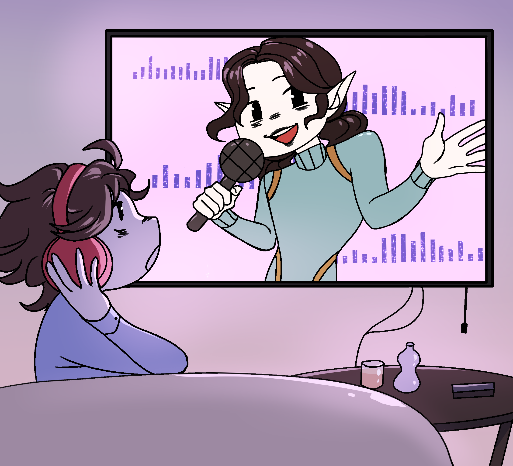

# About disintar

<figure><figcaption></figcaption></figure>

[Disintar.io](https://beta.disintar.io/) is where the future of NFTs begins! As the first NFT marketplace on the revolutionary The Open Network blockchain, we're bringing a new level of style and comfort to the world of digital collectibles. With our platform, anyone can easily and effortlessly publish their work on TON, no technical knowledge required. Plus, our one-of-a-kind room-shaped NFT storage profiles allow you to showcase your beautiful NFTs in a truly unique and personalized way. Furnish and improve your profile to your heart's content and let your NFTs shine like never before. Join the cutting-edge world of TON and be a part of the future of digital collectibles with [Disintar.io](https://disintar.io/).

\
